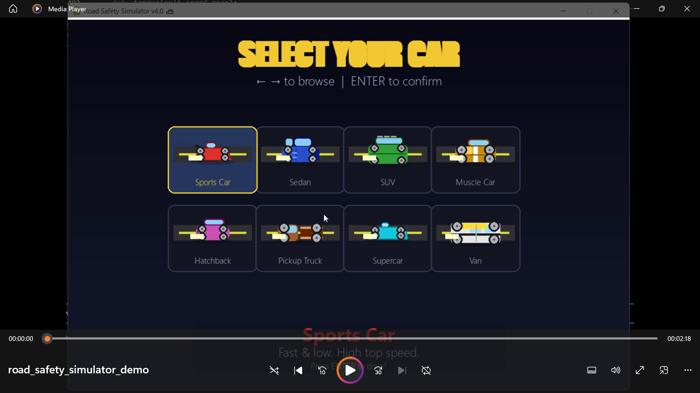
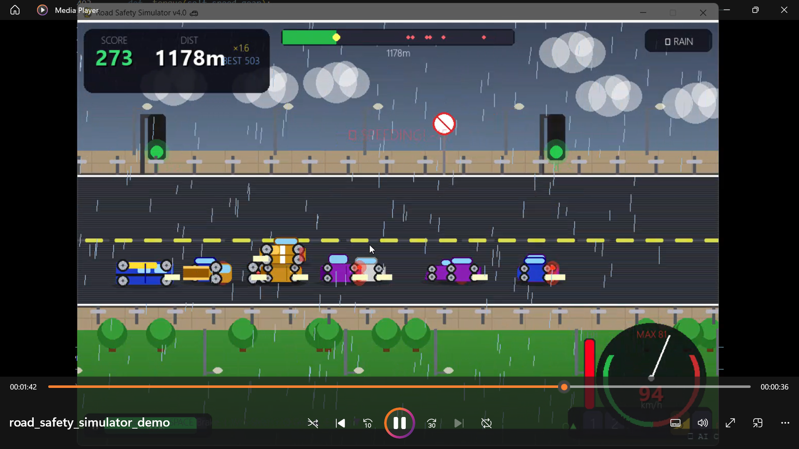
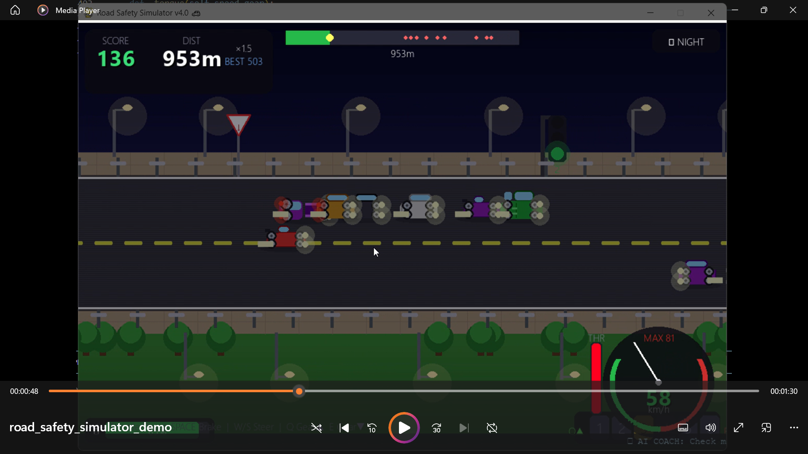
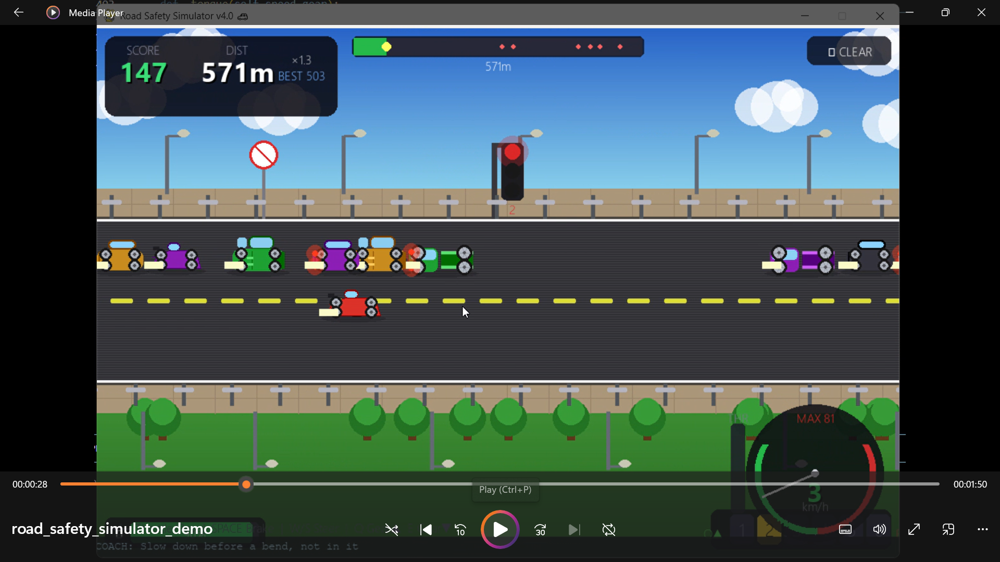

# Road Safety Simulator v4.0

A Python + Pygame driving simulation game featuring realistic physics, dynamic weather, AI driving coach, procedural road generation, and traffic safety mechanics.

---

## Features

- Realistic driving physics
- Manual 6-speed gearbox
- Dynamic weather system
- Infinite procedural road
- Traffic lights and pedestrian crossings
- AI driving coach
- High score system
- Multiple car models
- Fuel management system

---

## Technologies Used

- Python
- Pygame
- NumPy
- Requests API

---

## Installation

```bash
pip install pygame numpy requests
```

---

## Run the Project

```bash
python road_safety_simulator.py
```

---

## Controls

| Key | Action |
|-----|--------|
| D / Right Arrow | Accelerate |
| A / Left Arrow | Reverse |
| SPACE | Brake |
| W / Up Arrow | Move Up |
| S / Down Arrow | Move Down |
| Q | Gear Up |
| E | Gear Down |
| ESC | Quit |

---

## Screenshots

### Gameplay


### Rain Mode


### Night Mode


### Traffic System


---

## Demo Video

https://youtu.be/L2HsWq8MANE


---

## Authors

- Divija Kalra
- Okesh Dayma
- Zoya Altaf
